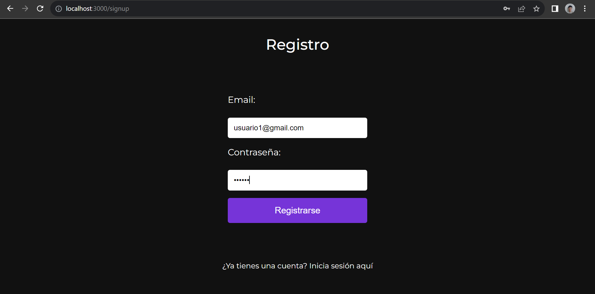
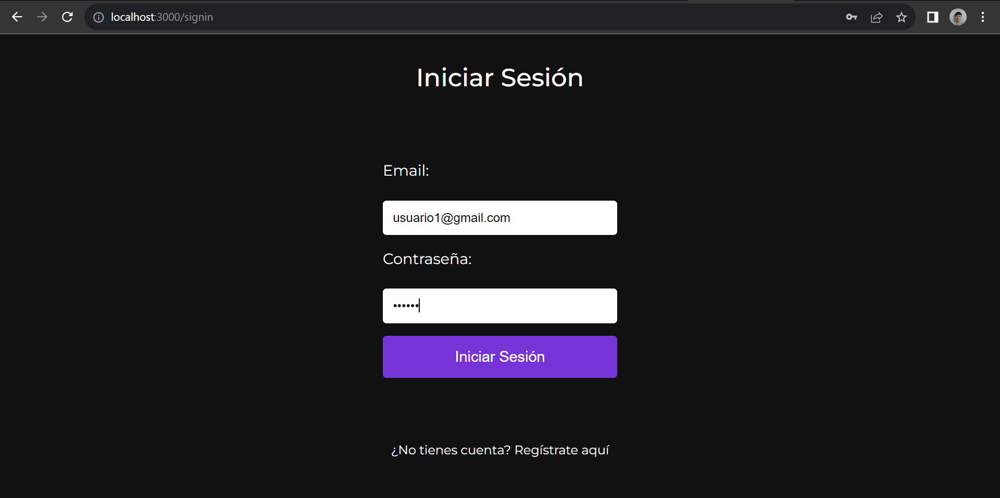
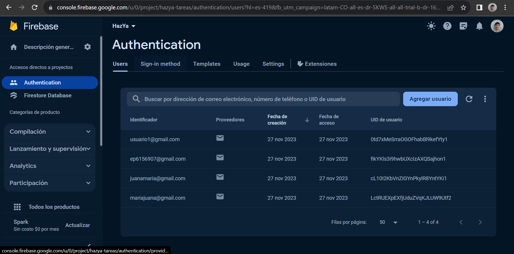
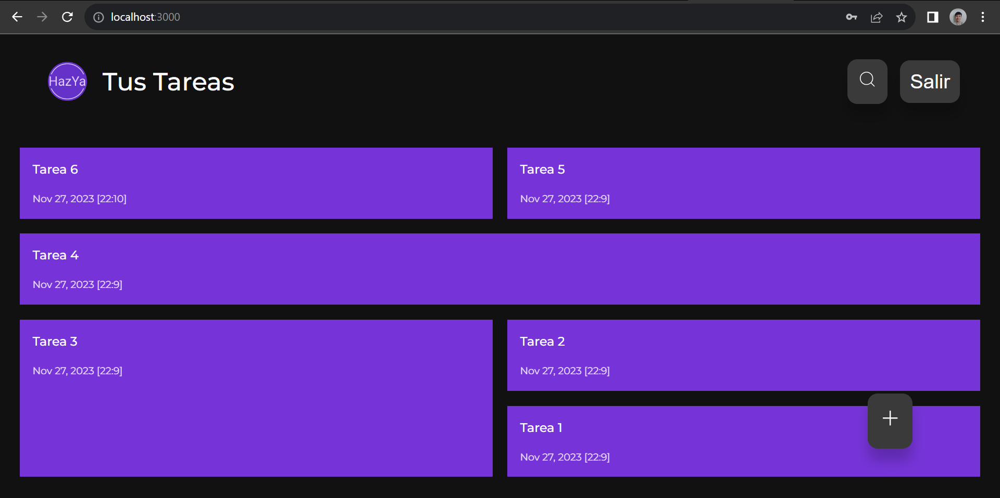
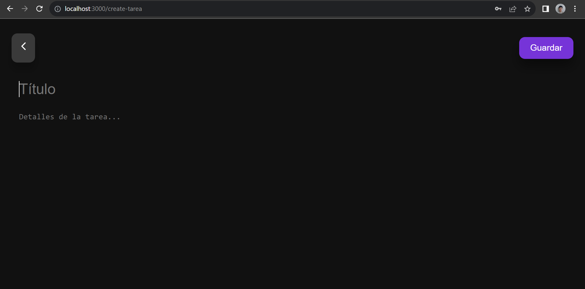
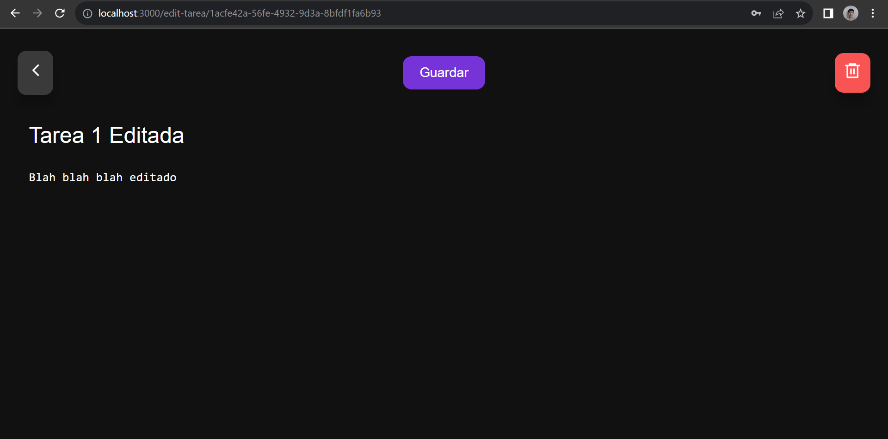
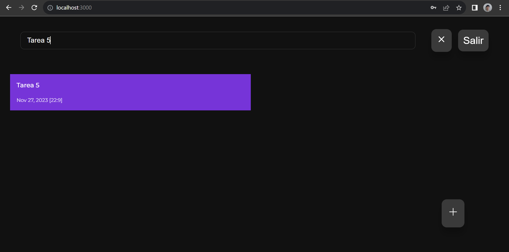
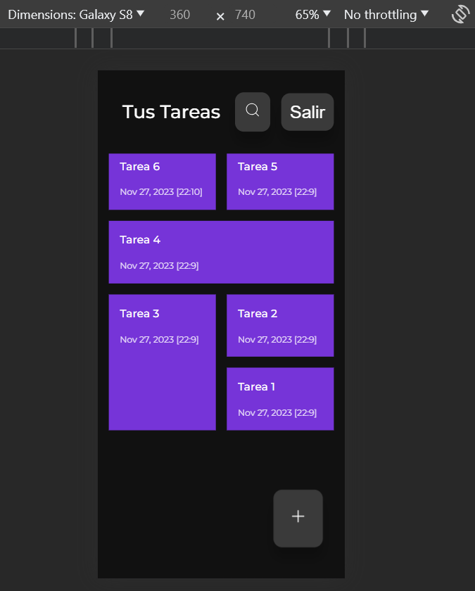

# Proyecto Final React - Tareas App #

* Estudiante 1: Pablo Andrés Lugo Ramírez - Código: 0000219665
* Estudiante 2: Daniela Alejandra Puerto Díaz - Código: 0000220606
* Estudiante 3: Yeyson Esteban Pulido Parra - Código: 0000222746

### Registro ###

### Inicio Sesión ###

### Usuarios en Firebase ###

### Home ###

### Crear Tarea ###

### Editar/Eliminar Tarea ###

### Buscar Tareas ###

### Responsive Design ###

